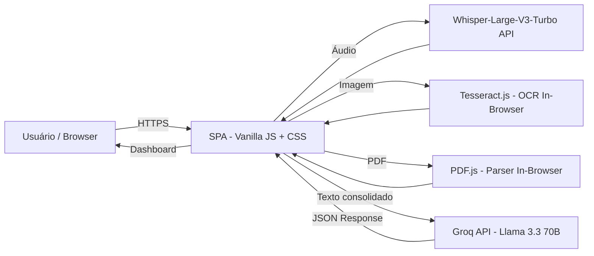
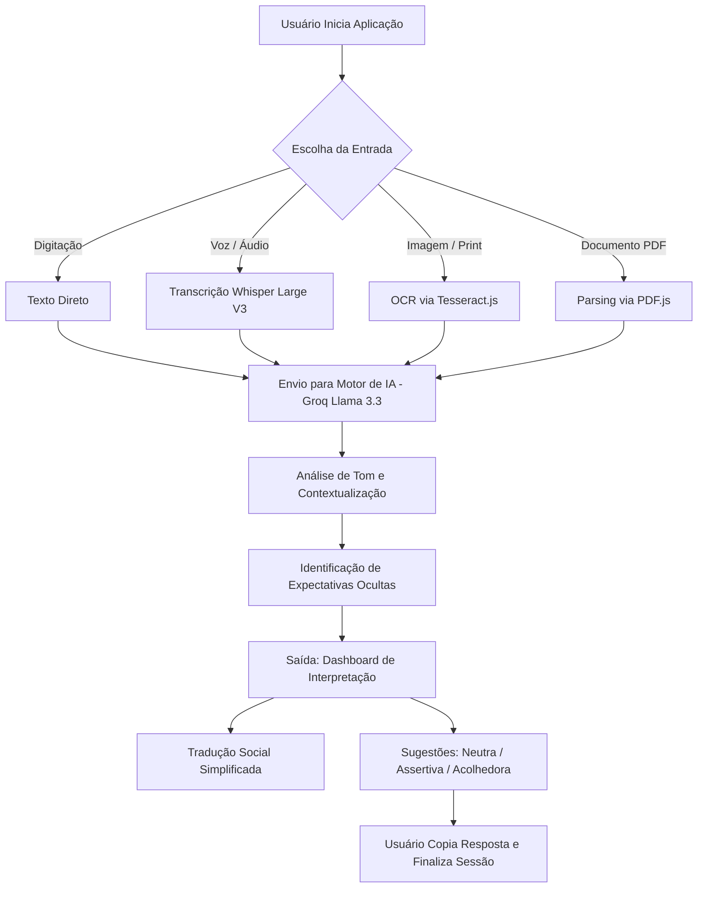

# Social Interpreter
> ***Inteligência Artificial para Acessibilidade Cognitiva***
> 

---

## 1. Visão Geral

### Problema

Estima-se que até 20% da população mundial possua algum grau de neurodivergência. A comunicação humana é fundamentada em aproximadamente 70% de tons não literais, ironia, implícitos e linguagem corporal expressa em texto. Para indivíduos que processam informações de forma literal ou analítica, essa "zona cinzenta" comunicativa gera ansiedade, paralisia por análise e mal-entendidos recorrentes com figuras de autoridade, como gestores e professores.

O Social Interpreter nasce para atacar diretamente esse gap: oferecer a decodificação dessas nuances em tempo real, reduzindo o burnout social causado pelo esforço constante de *masking* (simulação de comportamentos neurotípicos).

### Público-alvo

O produto é desenvolvido para adultos neurodivergentes (Autismo Nível 1, TDAH e Ansiedade Social) em contextos acadêmicos e corporativos, com foco em dois perfis principais:

**Persona A - Acadêmica:** Estudante universitário neurodivergente que recebe e-mails curtos de professores e tem dificuldade em distinguir se o tom é de cobrança formal ou apenas informativo.

**Persona B - Corporativa:** Profissional em cargo técnico que recebe feedbacks subentendidos via Slack/Teams e não sabe como responder de forma assertiva sem aparentar rudeza ou submissão.

### Objetivo do Sistema

Prover uma camada de tradução social inteligente entre a mensagem recebida e a interpretação funcional do usuário neurodivergente. O sistema analisa entradas multimodais (texto, áudio, imagem e PDF), identifica o tom emocional e as intenções ocultas da comunicação, e retorna três sugestões de resposta calibradas: Neutra, Assertiva e Acolhedora. Devolvendo ao usuário autonomia comunicativa e reduzindo significativamente a carga cognitiva diária.

---

## 2. Requisitos (PRD)

### Requisitos Funcionais

| ID | Requisito | Descrição |
| --- | --- | --- |
| RF01 | Entrada Multimodal | O usuário deve poder inserir dados via Texto direto, Áudio (Voice-to-text via Whisper), Imagem (Screenshots via OCR/Tesseract.js) ou Documentos PDF (via PDF.js). |
| RF02 | Análise de Contexto Social | O sistema deve processar a entrada e retornar o tom provável, o resumo da situação social e as intenções ocultas presentes na mensagem. |
| RF03 | Gerador de Respostas | O sistema deve oferecer ao usuário 3 sugestões de resposta calibradas: Neutra, Assertiva e Acolhedora. |

### Requisitos Não Funcionais

| ID | Requisito | Descrição |
| --- | --- | --- |
| RNF01 | Privacidade Efêmera | Nenhuma mensagem enviada deve ser persistida em bancos de dados do servidor. O processamento deve ser totalmente volátil e stateless. |
| RNF02 | Neutralidade Assistiva | A IA não deve sugerir comportamentos hostis, manipuladores ou que violem normas legais e éticas vigentes. |
| RNF03 | Acessibilidade de Linguagem | O resumo interpretativo deve obrigatoriamente evitar jargões complexos, sendo compreensível para usuários em estado de ansiedade elevada. |
| RNF04 | Performance de Inferência | O sistema deve entregar análises em tempo responsivo, aproveitando a arquitetura LPU da Groq para alcançar centenas de tokens por segundo. |
| RNF05 | Footprint Mínimo | A aplicação deve operar como SPA sem dependências de backend pesado, garantindo baixo custo operacional e facilidade de hospedagem. |

---

## 3. Arquitetura

### Diagrama

### Stack

| Camada | Tecnologia | Função |
| --- | --- | --- |
| Motor NLP Principal | Llama 3.3 70B Versatile (Groq) | Análise de tom, contextualização social e geração das 3 sugestões de resposta. |
| Transcrição de Áudio | Whisper-Large-V3-Turbo (Groq) | Transcrição pt-BR de alta fidelidade para captar nuances de fala. |
| Visão Computacional | Tesseract.js | OCR in-browser de prints de conversa sem upload para servidor externo. |
| Parse de Documentos | PDF.js | Extração de texto de arquivos PDF diretamente no browser. |
| Front-End | Vanilla JavaScript + CSS Moderno | SPA com baixo footprint e foco total em acessibilidade visual. |
| Infraestrutura de IA | Groq Cloud (LPU) | Inferência de LLM com velocidade de centenas de tokens/segundo. |

---

## 4. Fluxos

### Fluxo Principal

### Fluxos Alternativos

**Fluxo A - Falha de Reconhecimento de Áudio:** Caso o Whisper não consiga transcrever o áudio com fidelidade mínima (baixa qualidade de microfone ou ruído excessivo), o sistema exibe um alerta acessível e redireciona o usuário para a entrada por texto ou imagem, sem perda de contexto.

**Fluxo B - PDF com Conteúdo Não Extraível:** Quando o PDF enviado é baseado em imagem (documento escaneado), o PDF.js não consegue extrair texto via parsing convencional. O sistema informa o usuário e sugere o upload do arquivo como imagem para processamento via OCR/Tesseract.js.

**Fluxo C - Chave de API Inválida ou Ausente:** Caso o usuário não tenha configurado uma chave de API válida (RF04), o sistema bloqueia o envio da análise e exibe instruções claras e acessíveis de como obter e configurar a chave Groq, sem expor mensagens de erro técnico.

---

## 5. Modelos / IA

### Tipo de Modelo

O sistema utiliza dois modelos via infraestrutura Groq: o **Llama 3.3 70B Versatile**, modelo de linguagem de grande porte (LLM) para análise de tom, contextualização social e geração de sugestões de resposta; e o **Whisper-Large-V3-Turbo**, modelo de reconhecimento de fala (ASR) para transcrição de áudio em pt-BR de alta fidelidade.

### Dados Usados

O sistema opera em modo zero-shot/few-shot inferencing, não há fine-tuning ou treinamento customizado com dados dos usuários. Todo processamento é baseado em prompt engineering estruturado com instruções de papel, contexto do usuário e formato esperado de saída, combinado com a entrada fornecida em tempo real pelo próprio usuário na sessão ativa. Nenhum dado histórico de sessões anteriores é armazenado ou reutilizado, em conformidade com RNF01.

### Limitações

| Limitação | Descrição | Mitigação Prevista |
| --- | --- | --- |
| Compreensão Cultural | Possível viés ocidental na interpretação de expressões idiomáticas regionais brasileiras. | Fine-tuning futuro com corpus pt-BR regional ou uso de RAG com dicionário de expressões. |
| Contexto Multi-Turno | Sem memória entre sessões; cada análise é independente. | Implementação de contexto de sessão volátil com janela de tokens para análises em sequência. |
| Ambiguidade Alta | Em mensagens extremamente lacônicas, o modelo pode superestimar a negatividade do tom. | Prompt calibrado com instrução de viés positivo e aviso ao usuário sobre incerteza da análise. |
| Áudio Ruidoso | O Whisper pode transcrever incorretamente em ambientes com muito ruído de fundo. | Filtro de qualidade de áudio com redirecionamento para entrada textual alternativa. |
| Dependência de API | O sistema depende da disponibilidade da Groq Cloud. Downtime impacta todos os usuários. | Roadmap de longo prazo prevê modelos ONNX/WebLLM para processamento 100% local. |

---

## 6. Base de Dados (Prevista)

O MVP atual opera sem persistência de dados (stateless), conforme RNF01. A evolução para planos PRO e Enterprise exigirá uma camada de banco de dados para gestão de usuários, assinaturas e métricas de uso anonimizadas.

### Estrutura

**Tabela: `users`**

| Campo | Tipo | Descrição |
| --- | --- | --- |
| id | UUID (PK) | Identificador único do usuário. |
| email | VARCHAR(255) | E-mail de login (autenticação via OAuth ou Magic Link). |
| plan_type | ENUM | Plano atual: `freemium`, `pro`, `enterprise`. |
| created_at | TIMESTAMP | Data de criação da conta. |
| api_key_hash | VARCHAR(64) | Hash da chave de API do usuário (nunca armazenada em texto plano). |

**Tabela: `subscriptions`**

| Campo | Tipo | Descrição |
| --- | --- | --- |
| id | UUID (PK) | Identificador único da assinatura. |
| user_id | UUID (FK) | Referência ao usuário (tabela `users`). |
| status | ENUM | Status: `active`, `canceled`, `trial`. |
| started_at | TIMESTAMP | Início da assinatura ou trial. |
| expires_at | TIMESTAMP | Data de expiração ou renovação. |
| stripe_sub_id | VARCHAR(100) | ID da assinatura no gateway de pagamento (Stripe). |

**Tabela: `usage_metrics` (Anonimizada)**

| Campo | Tipo | Descrição |
| --- | --- | --- |
| id | UUID (PK) | Identificador único do registro. |
| user_id | UUID (FK, nullable) | Referência ao usuário, `null` para sessões anônimas freemium. |
| input_type | ENUM | Tipo de entrada: `text`, `audio`, `image`, `pdf`. |
| tokens_consumed | INTEGER | Quantidade de tokens consumidos na análise. |
| created_at | TIMESTAMP | Timestamp da análise. O conteúdo da mensagem nunca é armazenado. |

### Principais Tabelas

As três tabelas acima formam o núcleo do modelo de dados: `users` gerencia identidade e plano, `subscriptions` controla o ciclo de vida da assinatura via Stripe, e `usage_metrics` registra apenas metadados de uso para analytics, sem jamais persistir o conteúdo das mensagens analisadas.

**Tecnologia sugerida:** Supabase (PostgreSQL gerenciado), por oferecer autenticação integrada, Row Level Security (RLS) para isolamento de dados por usuário e plano gratuito generoso para validação do produto.

---

## 7. Decisões Técnicas

| Decisão | Alternativas Consideradas | Motivo da Escolha |
| --- | --- | --- |
| Groq + Llama 3.3 como motor NLP | OpenAI GPT-4o, Anthropic Claude, Google Gemini | Velocidade de inferência superior via LPU. Custo mais baixo por token para prototipagem. API compatível com OpenAI SDK, reduzindo curva de migração futura. |
| Whisper-Large-V3-Turbo para ASR | Google Speech-to-Text, AssemblyAI | Já disponível na infraestrutura Groq, eliminando dependência de terceiro adicional. Alta fidelidade para pt-BR integrada ao mesmo provider. |
| Tesseract.js para OCR in-browser | AWS Textract, Google Cloud Vision (server-side) | Processamento 100% client-side: nenhum print de conversa privada trafega para servidor externo. Fortalece RNF01 sem custo adicional de API. |
| Vanilla JS + CSS (sem framework) | React, Vue, Angular | Zero dependências de framework reduzem bundle size e complexidade de deploy. Foco em acessibilidade sem overhead de virtual DOM para uma SPA de escopo definido. |
| SPA sem backend próprio | API REST dedicada em Node.js ou Python/FastAPI | Reduz drasticamente o time-to-market e o custo operacional do protótipo. Toda lógica de negócio reside no prompt engineering e na API Groq. |

---

## 8. Riscos

### Técnicos

| Risco | Probabilidade | Impacto | Mitigação |
| --- | --- | --- | --- |
| Downtime ou mudança de preços da Groq API | Média | Alto | Abstrair a camada de LLM com interface compatível com OpenAI SDK para troca rápida de provider (fallback para OpenAI ou Anthropic). |
| Degradação do OCR em imagens de baixa qualidade | Alta | Médio | Implementar pré-processamento de imagem (contraste, binarização) antes do Tesseract.js e exibir score de confiança ao usuário. |
| Alucinação do modelo em contextos ambíguos | Média | Alto | Calibrar temperatura do modelo para valores baixos (0.3–0.5) e instruir o prompt a declarar incerteza quando o tom for indeterminado. |
| Rate limiting no plano freemium | Alta | Médio | Implementar contador de uso local no browser (localStorage) e bloqueio suave com mensagem de upgrade acessível. |
| Quebra de privacidade por logs da Groq API | Baixa | Muito Alto | Revisar o DPA da Groq e adicionar aviso claro nos Termos de Uso sobre o processamento via terceiro. |

### Negócio

| Risco | Probabilidade | Impacto | Mitigação |
| --- | --- | --- | --- |
| Concorrência de features nativas em plataformas (ex: Copilot no Teams) | Média | Alto | Fortalecer o nicho: nenhum player generalista oferece linguagem acessível focada em neurodivergentes. Construir comunidade e brand equity. |
| Regulatório: LGPD e dados sensíveis de saúde | Média | Muito Alto | Dados de neurodivergência podem ser classificados como dados sensíveis (Art. 11 da LGPD). Adotar Privacy by Design e consultar assessoria jurídica especializada antes de qualquer lançamento com cadastro. |
| Dificuldade de monetização Enterprise sem estrutura jurídica | Alta | Médio | Formalizar a empresa antes de negociações B2B. Explorar aceleradoras de impacto social (PIPE/FAPESP) para capital inicial. |
| Estigma do público-alvo em assumir neurodivergência | Média | Médio | Posicionar o produto como ferramenta de "comunicação profissional inteligente" para um público mais amplo, com benefício adicional para neurodivergentes. |

---

## 9. Próximos Passos

**Curto Prazo**

1. Extensão de navegador (Chrome/Firefox) com integração direta ao WhatsApp Web, LinkedIn e Slack, oferecendo sugestões em tempo real na caixa de digitação do usuário.
2. Implementação de contador de uso freemium com localStorage e tela de upgrade acessível e não punitiva.
3. Refinamento do prompt engineering com testes A/B para calibrar o viés de tom positivo e reduzir alucinações em mensagens ambíguas.

**Médio Prazo**

1. App Mobile com teclado customizado (iOS/Android) que sugere tons de resposta durante a escrita, operando nativamente no dispositivo.
2. Integração com backend Supabase para gestão de assinaturas PRO e métricas de uso anonimizadas.
3. Lançamento de Plano Enterprise com piloto em ao menos 2 empresas parceiras com programas ativos de DE&I.

**Longo Prazo**

1. IA Offline/Local (ONNX/WebLLM): migração do motor de inferência para modelos que rodam 100% no dispositivo do usuário, eliminando completamente qualquer tráfego de dados para servidores externos.
2. Parceria com universidades para validação clínica do impacto do produto na redução do burnout social em populações neurodivergentes.
3. Expansão internacional para mercados de língua espanhola e inglesa, aproveitando a infraestrutura multilingual do Llama 3.3.

---

**Conclusão**

O Social Interpreter é um dos projetos com maior potencial de impacto real observado neste ciclo. A combinação de problema genuíno, stack técnica enxuta e modelo de monetização bem calibrado coloca o projeto em posição de validação rápida. O principal risco não é técnico — é de execução: garantir que a interface seja simples o suficiente para que o usuário em momento de ansiedade consiga usar a ferramenta sem fricção adicional. Se esse princípio for mantido como guia em todas as decisões de design e desenvolvimento, o projeto tem fundamento sólido para evoluir de protótipo para produto.

**Grupo**
- Bruno Pessoa
- João Victor Bathomarco
- Guilherme Bastos
- Gabriel de Santi 
