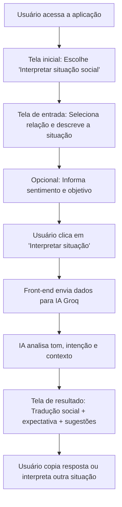

# Social Interpreter — Entenda o que não foi dito

Um intérprete de contexto social para pessoas neurodivergentes (autismo, TDAH, ansiedade social), que transforma mensagens e situações confusas em explicações claras e opções seguras de resposta.

## 🚀 Visão do Produto
O **Social Interpreter** é uma ferramenta de apoio para decodificar subtexto, ironia, indiretas e "regras não ditas" em conversas do dia a dia. Focado especialmente nos ambientes acadêmico e profissional, o app ajuda a reduzir a ansiedade social e evitar mal-entendidos.

## 🧠 Problema que será resolvido
Pessoas neurodivergentes frequentemente enfrentam dificuldades em:
- Interpretar o tom de mensagens de professores, chefes ou colegas.
- Entender qual é a real expectativa da outra pessoa.
- Formular respostas adequadas sem o esgotamento mental causado pelo "masking" ou pela tentativa constante de decodificação.

## 🛠️ Como funciona (Fluxo)

## ✨ Funcionalidades Principais
1. **Entrada da situação**: Campo para colar textos ou descrever falas.
2. **Contextualização**: Seleção de relação (Professor, Chefe, Amigo, etc.) e estado emocional.
3. **Tradução Social**: Explicação direta do que o outro provavelmente quis comunicar.
4. **Expectativas claras**: Lista o que a pessoa provavelmente espera de você agora.
5. **Sugestões de resposta**: 3 modelos prontos (Neutra, Assertiva, Acolhedora).

## 🚀 Como rodar a aplicação
A aplicação é uma SPA (Single Page Application) que não necessita de servidor backend complexo, rodando diretamente no navegador.

1. Clone o repositório ou baixe o arquivo `index.html`.
2. Abra o arquivo `index.html` em qualquer navegador moderno.
3. A aplicação já está configurada com uma chave de API **Groq** e o modelo **llama-3.3-70b-versatile** para garantir velocidade e precisão.

## ⚠️ Aviso Legal
Esta ferramenta é um apoio para compreensão social do dia a dia e **não substitui** acompanhamento terapêutico, psicológico ou jurídico.

---
*Desenvolvido como um MVP para acessibilidade e inclusão social.*
