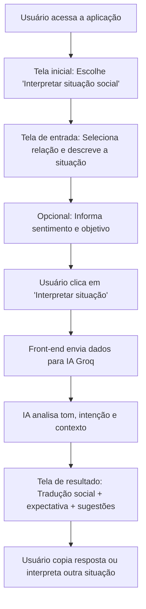

# Social Interpreter — Entenda o que não foi dito

Um intérprete de contexto social para pessoas neurodivergentes (autismo, TDAH, ansiedade social), que transforma mensagens e situações confusas em explicações claras e opções seguras de resposta.

Site para teste - https://brnpessoa14.github.io/social-interpreter/

## 🚀 Visão do Produto
O **Social Interpreter** é uma ferramenta de apoio para decodificar subtexto, ironia, indiretas e "regras não ditas" em conversas do dia a dia. Focado especialmente nos ambientes acadêmico e profissional, o app ajuda a reduzir a ansiedade social e evitar mal-entendidos.

## 🧠 Problema que será resolvido
Pessoas neurodivergentes frequentemente enfrentam dificuldades em:
- Interpretar o tom de mensagens de professores, chefes ou colegas.
- Entender qual é a real expectativa da outra pessoa.
- Formular respostas adequadas sem o esgotamento mental causado pelo "masking" ou pela tentativa constante de decodificação.

## 🛠️ Como funciona (Fluxo)

## ✨ Funcionalidades Principais
1. **Entrada da situação**: Campo para colar textos ou descrever falas.
2. **Contextualização**: Seleção de relação (Professor, Chefe, Amigo, etc.) e estado emocional.
3. **Tradução Social**: Explicação direta do que o outro provavelmente quis comunicar.
4. **Expectativas claras**: Lista o que a pessoa provavelmente espera de você agora.
5. **Sugestões de resposta**: 3 modelos prontos (Neutra, Assertiva, Acolhedora).

## 🚀 Como rodar a aplicação
A aplicação é uma SPA (Single Page Application) que não necessita de servidor backend complexo, rodando diretamente no navegador.

1. Clone o repositório ou baixe o arquivo `index.html`.
2. Abra o arquivo `index.html` em qualquer navegador moderno.
3. A aplicação já está configurada com uma chave de API **Groq** e o modelo **llama-3.3-70b-versatile** para garantir velocidade e precisão.

## ⚠️ Aviso Legal
Esta ferramenta é um apoio para compreensão social do dia a dia e **não substitui** acompanhamento terapêutico, psicológico ou jurídico.

---

## 📈 Análise de Mercado
O mercado de tecnologias assistivas e bem-estar em saúde mental está em franca expansão. Estima-se que 15% a 20% da população mundial seja neurodivergente. Há uma crescente conscientização sobre neurodivergências na idade adulta (ex: autismo nível 1 de suporte e TDAH), compondo um público produtivo que carece de ferramentas feitas para reduzir o alto custo cognitivo nas interações.

**Público-alvo:** 
- Adultos neurodivergentes engajados em trabalhos ou universidades.
- Pessoas com ansiedade social ou estresse ocupacional.

**Diferencial Competitivo:**
Enquanto assistentes genéricos (como ChatGPT) são prolixos e demandam a criação de "prompts" textuais complexos, o **Social Interpreter** abstrai essa dificuldade em uma interface extremamente minimalista, multimodalpelo uso voz/imagens e voltada apenas para entregar soluções mastigadas (Opções Neutras/Assertivas).

## 📊 Regras de Negócio
Para garantir um produto viável, ético e focado, aplicam-se as seguintes Regras de Negócio fundamentais (RN):

1. **Privacidade e Efemeridade (RN01)**: Nenhuma conversa, áudio, foto de tela ou inserção pode ser salva em bancos de dados. Todo o processamento termina quando a resposta é entregue a fim de proteger o sigilo das interações reais.
2. **Comunicação Direta (RN02)**: O processamento de linguagem natural e o prompt nativo devem forçar o sistema a abolir uso de duplos sentidos, sarcasmo e textões em sua resposta.
3. **Autonomia (Man on the loop) (RN03)**: A ferramenta gera dicas e opções, mas em NENHUM momento o Social Interpreter disparará uma mensagem automatizada na rede social da pessoa: quem decide ler, copiar e colar é o usuário, assumindo total autonomia pela ação.
4. **Limitação de Escopo (RN04)**: Por medidas de segurança e para reduzir riscos sistêmicos, a IA é proibida de sugerir comportamentos que quebrem regras legais, além de não poder agir ou atuar como psicólogo clínico sob qualquer circunstância.

---

## 🚀 Evoluções Futuras & Modelos de Negócio

Com o amadurecimento técnico do produto, o objetivo principal atual é evoluir a aplicação de um MVP de prova de conceito para um ecossistema digital sustentável, abrangendo escalabilidade técnica, melhorias de Produto (visando retenção) e definindo vetores claros de **Monetização e Modelos de Negócio**.

### 1. Evolução do Produto (Roadmap)
Para que a percepção de valor aumente e justifique as vias de monetização, o produto deve evoluir para além de um simples "tradutor de única via", tornando-se um **Co-piloto Pessoal de Habilidades Sociais**:

*   **Histórico e Relatório Pessoal de Evolução:** Salvar as análises de conversas passadas atreladas a tags e fornecer um dashboard demonstrando o progresso na interpretação autônoma.
*   **Integrações Contextuais (Teclados Mobile / Extensões):** Levar o intérprete para onde a conversa acontece (WhatsApp, iMessage, Slack ou Extensões de Navegador).
*   **Ajuste de Personalidade do "Copiloto":** Treinar a IA para moldar sugestões de resposta de acordo com a área do usuário (ex: ser mais assertivo no ambiente corporativo).
*   **Sintetização de Voz para Treinamento de Prosódia:** Ajudar o usuário a entender as nuances vocais das sugestões de resposta utilizando modelos de IA generativa de voz.

### 2. Modelos de Negócio & Estratégia de Receita ("Render Dinheiro")
Estratégia baseada na fragmentação em frentes específicas:

1. **B2C - Freemium & Assinatura Individual (PRO)**
    *   **Básico (Gratuito):** Limitado a 5 análises textuais diárias. Monetização complementar via "Patrocínio Institucional ESG".
    *   **Social Interpreter PRO (Recorrente):** Análises ilimitadas, ambiente 100% privado, opções multimodais (Envio de Imagens/PDF e Áudio). Preço sugerido: R$ 19,90/mês.

2. **B2B - Licenciamento para Terapeutas e Clínicas**
    *   **Clinical Dashboard:** Psicólogos e Terapeutas Ocupacionais detêm contas "guarda-chuva" integrando seus pacientes. Geração automática de relatórios mostrando "picos de ansiedade/interação" para análise nas sessões clínicas. Preço Premium Corporativo (B2B).

3. **B2B2C - Benefício Corporativo (RH Inclusivo)**
    *   **Plano Enterprise Inclusão:** Auxilia RH's no Onboarding, vendendo pacotes anuais de licenças "PRO" que são repassadas a colaboradores como benefício corporativo para a área de saúde mental.

4. **Pay-per-use (Tokens Avulsos)**
    *   **Pacotes de Créditos:** Direcionados a quem tem aversão a assinaturas, compra-se tokens (ex: R$ 4,90/pacote) para destravar ações pontuais complexas que custam tempo processual.

---
*Desenvolvido como um MVP para acessibilidade e inclusão social.*